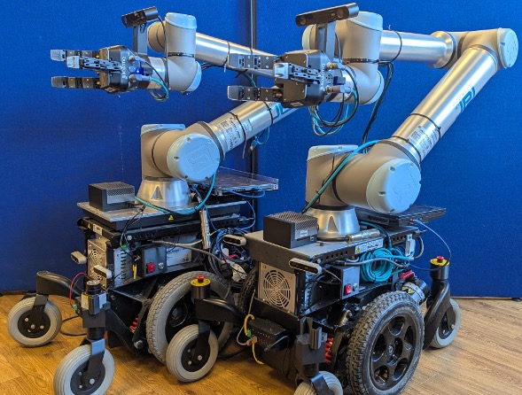

# AMIGA Primitives

<p align="center">

</p>


This repo was part of my PhD work at the [Personal Robotics Laboratory](https://www.imperial.ac.uk/personal-robotics). It contains manipulation side of the code I developped to operate the AMIGA and AMIGO robots. This includes primitives such as grasping, placing, handing objects over, or failing on purpose.


Features:
- **Modular components** embedded in [Docker](https://docs.docker.com/get-started/docker-overview/) images, using [ZMQ](https://zeromq.org/) for communication between modules. 
- **Imitation learning pipeline**: data collection, training, and evaluation.

> [!IMPORTANT] 
> Some aspects of the code are specific to the experimental setup. This repo will require adjustments to be used if you do not have access to our robots. Some parts could still be useful for other setups, such as the Dockerfiles, the ZMQ communication classes, or the imitation learning pipeline.


## Installation

Prerequisites:
- [Pixi](https://pixi.sh/latest/advanced/installation/), our package manager (alternative to conda, mamba, pip, uv...)
- [Docker](https://docs.docker.com/get-started/get-docker/), our container engine

Once both are installed, you can run the following:
```bash
# Clone the repo
git clone https://github.com/cedricgoubard/amiga_primitives.git

# Install dependencies
pixi install
```

## Usage/Examples
We use ZMQ to communicate between modules. All the modules (`AMIGA`, `ZEDCamera`, `RealsenseCamera`) inherit from `amiga.drivers.zmq.ZMQBackend`. Here is how it works:
- Every child of `ZMQBackend` must implement the `get_methods` method, which returns a dictionary with the methods and args that the class wants to expose to the ZMQ server.
- To create a ZMQ server, instantiate your class and pass it as an argument to `amiga.driver.zmq.ZMQServer`, which requires a hostname and port.
- For client-side communication, each backend inherits the `make_zmq_client()` method, which creates a `ZMQClient` with dynamically generated methods. Here's an example:

```python
import amiga

class MyNewBackend(amiga.drivers.zmq.ZMQBackend):
    def get_methods(self):
        return {'my_method': ['arg1', 'arg2']}

    def my_method(self, arg1, arg2):
        return arg1 + arg2


### Server Side
cfg = omegaconf.OmegaConf.load("path") 
back = MyNewBackend()
server = amiga.drivers.zmq.ZMQServer(cfg.hostname, cfg.port, back)
server.serve()

### Client side
cfg = omegaconf.OmegaConf.load("path")  # Reuse the same file
back = MyNewBackend()
client = back.make_zmq_client(cfg.hostname, cfg.port)
client.my_method(1, 2)  # Returns 3
``

## Contributing
Contributions are welcome! Please submit a pull request or open an issue if you find any bugs or have any suggestions.

## License
This project is licensed under the MIT License.